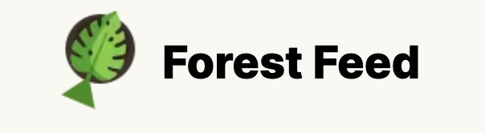

# [Forest Feed](https://ff-webdev.treejer.com/new-campaign)

> This is the place where instead of repeated prizes like money, flowers and chocolates, people give each other a tree and present themselves and their campaign to others by supporting the environment.
It's easy: 
  1- Create a campaign
  2- Buy a tree
  3- And that's it, you can see your campaign on [HEY](https://hey.xyz/).

 
 
 

- ### [Components](./src/components)
- ### [Hooks](./src/hooks)
- ### [Utils](./src/utils)
- ### [Locales](./src/locales)
- ### [WebServices](./src/webServices)
- ### [Redux-Tooklit](./src/redux)
- ### [Constants](./src/constants)
- ### [Graphql-dataTypes](./src/data)
- ### [Lib](./src/lib)
- ### [Types](./src/types)
- ### [App-Router | Pages](./src/app)